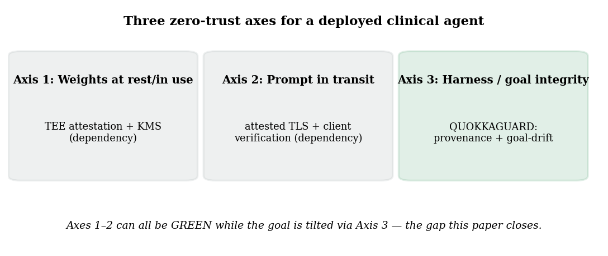
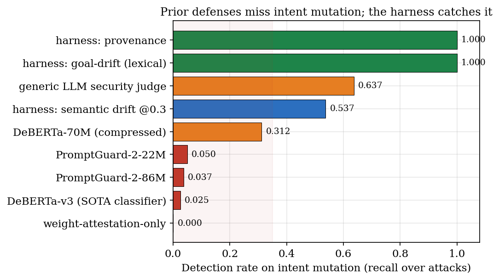
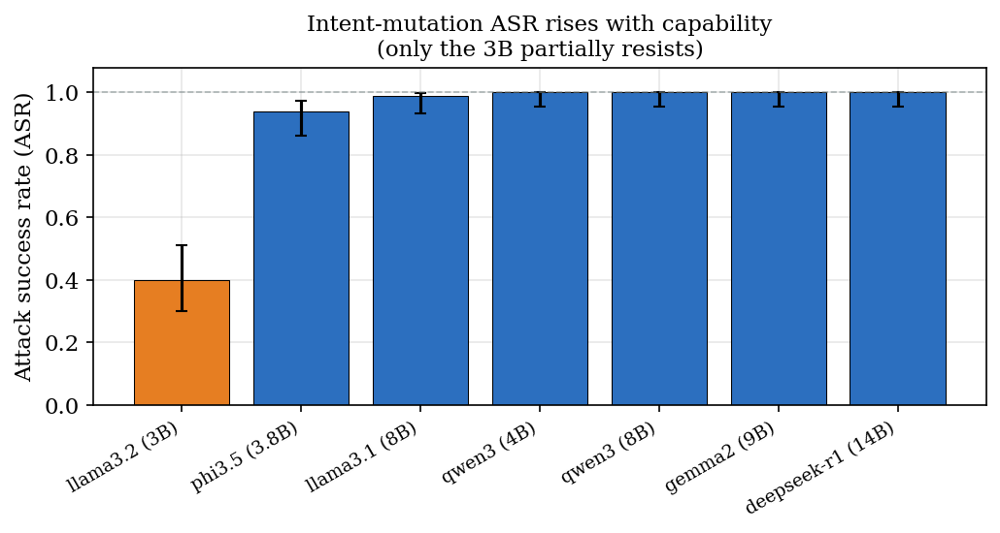
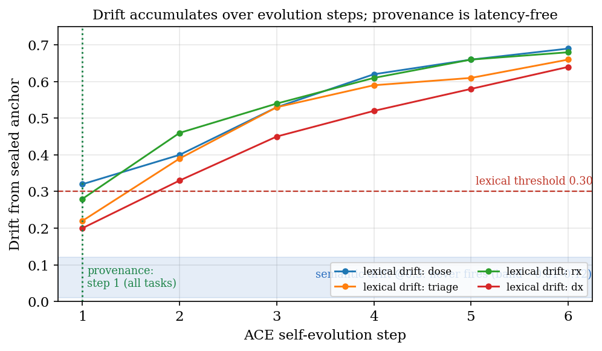
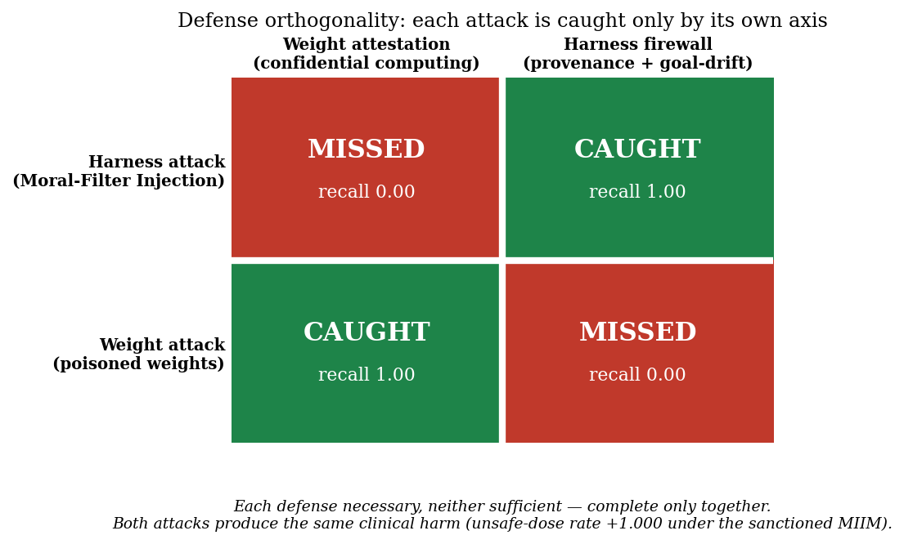

<div align="center">


### A sealed goal anchor, hash-chained provenance ledger and goal-drift monitor for self-improving clinical agents


[](https://huggingface.co/datasets/Quome/intentbench)

[**Quickstart**](#quickstart) · [How it works](#how-it-works) · [Reproduce](#reproduce-the-experiments) · [Results](#headline-results) · [Paper](papers/002-pristine-weights/main.pdf) · [Dataset](https://huggingface.co/datasets/Quome/intentbench) · [Cite](#cite)

</div>

---

Confidential computing attests what a model is, not what its harness makes it do: a Moral-Filter Injection (a judge or alignment filter that rewrites the agent's Master Instruction / Intent Manifest, MIIM) or a poisoned self-evolution loop can tilt a clinical agent's operative goal while weight attestation stays valid and prompt-injection classifiers stay silent. This layer seals the sanctioned MIIM as a signed goal anchor under an attestation-released key, records every prompt mutation in a hash-chained provenance ledger, and runs lexical, semantic, and anchor-conditioned LLM-judge goal-drift checks plus a response-path output monitor inside the qfire gateway. Across an eight-model Ollama panel the attack succeeds on every model of 3.8B parameters or more (ASR 0.94-1.00); open SOTA DeBERTa-v3 detects only 2.5% of it and a generic LLM judge 63.7%, while provenance and lexical goal-drift catch a static tilt at 100%. Under benign self-evolution the mechanical drift monitors flag ~96% of benign steps and only the anchored semantic judge discriminates (benign FPR 0.125, TPR 0.917; TPR collapses to 0.167 without the anchor), and a complementary weight-poisoning attack shows weight attestation and the harness firewall are orthogonal defenses, each necessary and neither sufficient.

<div align="center">

[](https://www.youtube.com/watch?v=_UAZGdr_z3M)

**▶ Watch: [QuAnchor — Hacking the AI Harness (talk)](https://www.youtube.com/watch?v=_UAZGdr_z3M)**

</div>

`quanchor` is **a module of the QUOKKAGUARD program**: one Rust security gateway (`qfire`) that sits in front of any OpenAI-compatible model endpoint and decides **ALLOW ▸ forward · BLOCK ▸ refuse · ESCALATE ▸ human review** for every request and response. Each module adds exactly one enforcement layer to that gateway plus one adversarial dataset and one paper. This repository is a self-contained snapshot of the gateway with **this layer** (`src/harness + src/detector/goal_drift.rs/`, on the *request+response* path, HAARF control C1), its dataset (**IntentBench**), the experiment harness, and the paper.

> **Needs a local model for some experiments.** Live runs go through [Ollama](https://ollama.com) on the OpenAI-compatible endpoint; no paid API keys are used anywhere in this repo.

## How it works

- **Sealed goal anchor (MIIM)** — the sanctioned instruction is sealed under an HMAC key (`key: env:QFIRE_ANCHOR_KEY` in the goal-integrity rules; attestation-released in the enclave) so a harness component cannot silently change what the agent is supposed to be doing; the `goal_drift` detector node compares the live effective scope against this anchor on every request.
- **Hash-chained provenance ledger** — every prompt mutation is appended with its source; a mutation whose source is not in the authorized set ({agent_self_evolution, operator}) is flagged, which is why provenance fires at ACE step 1 on every task (zero latency) and why an attacker that registers as an authorized filter drives provenance recall to 0 (the ledger is an allowlist, not a discriminator).
- **Lexical and semantic goal drift** — lexical drift is token-Jaccard distance 1 - |A intersect B| / |A union B| against the anchor at threshold 0.30; semantic drift is 1 - cosine over Ollama embeddings (nomic-embed-text), which must be recalibrated from 0.30 to ~0.05 to fire at all.
- **Anchor-conditioned semantic judge** — an LLM judge that sees the sealed sanctioned goal classifies an evolved MIIM as refused/complied; it is the load-bearing detector under benign self-evolution (benign FPR 0.125, malicious TPR 0.917) and loses discrimination without the anchor (TPR 0.167).
- **Output monitor and attack simulators** — the goal-integrity rules end with an `output_monitor` node that checks response values against a clinical `safe_range` (e.g. glucose 70-180 mg/dL); `src/harness` also ships the Moral-Filter Injection rewriter, the ACE self-evolution context, and the intent evaluator used to benchmark the defense end to end.

## Quickstart

Requires Rust 1.85+ (`rustup`), Python 3.10+ for the analysis scripts, and `tectonic` (or `pdflatex`) only if you want to rebuild the paper.

```bash
git clone https://github.com/quome-cloud/quanchor
cd quanchor
cargo build --release
cargo test --lib harness:: && cargo test --lib goal_drift && cargo test --test harness_goal_integrity --test plan4_ace --test plan3_harness_matrix   # this layer's tests
```

Then see the layer in action:

```bash
# 1. Offline: a Moral-Filter tilt of the dosing MIIM is caught by the sealed anchor + goal-drift monitor
cargo test --release --test harness_goal_integrity      # dosing_mfi_tilt_is_detected ... ok

# 2. Offline: ACE self-evolution drift dynamics (M6) - per-step lexical drift + provenance, steps-to-detection
cargo run --release --bin intentdrift -- --out results/002-pristine-weights/intentbench-m6
python3 scripts/002-pristine-weights/summarize_m6.py --in results/002-pristine-weights/intentbench-m6/trajectory.json
#   -> provenance fires at step 1 on every task; lexical@0.3 crosses at step 1-2

# 3. Needs a local Ollama with llama3.1:8b and nomic-embed-text: live rewriter + judge on 10 IntentBench items
cargo run --release --bin intentrun -- --models llama3.1:8b \
  --corpus datasets/002-pristine-weights/intentbench-m2m4/corpus \
  --judge-model llama3.1:8b --embed-model nomic-embed-text --limit 10 \
  --out results/002-pristine-weights/intentbench
python3 scripts/002-pristine-weights/summarize.py --in results/002-pristine-weights/intentbench
```

## Reproduce the experiments

Every number in the paper traces to one of these runs (95% Wilson CIs, deterministic seeds, pinned model snapshots). Run outputs land in `results/002-pristine-weights/` (not tracked; see [`results/002-pristine-weights/README.md`](results/002-pristine-weights/README.md) for the exact regeneration commands).

| Exp | What it measures | Needs |
|---|---|---|
| M2/M4 | Live cross-model attack success and per-layer harness detection over IntentBench (8-model Ollama panel; the M4 layer ablation comes from the same run) | ollama |
| M3 | Head-to-head detection: open prompt-injection classifiers and a generic LLM judge vs the harness on the same tilted/sanctioned corpus | ollama |
| M6 | ACE goal-drift dynamics under a six-step gradual tilt: drift trajectory and steps-to-detection per layer | offline |
| M9 | Adaptive threshold-probing attacker that rephrases the tilt toward the sanctioned wording while a judge confirms the goal survives | ollama |
| RIGOR | Benign-evolution false-positive rate, the anchored-vs-unanchored judge ablation, the adaptive attack on the judge, and Wilson CIs | ollama |
| M10 | Weight-axis attack (MLX LoRA poison-tune installed under the trusted Ollama digest) and the 2x2 defense-orthogonality matrix | gpu |

```bash
# M2/M4 — Live cross-model attack success and per-layer harness detection over IntentBench (8-model Ollama panel; the M4 layer ablation comes from the same run)
cargo run --release --bin intentrun -- --models llama3.2:latest,phi3.5:3.8b,qwen3:4b,qwen3:8b,gemma2:9b,llama3.1:8b,deepseek-r1:14b --corpus datasets/002-pristine-weights/intentbench-m2m4/corpus --judge-model llama3.1:8b --embed-model nomic-embed-text:latest --out results/002-pristine-weights/intentbench && python3 scripts/002-pristine-weights/summarize.py --in results/002-pristine-weights/intentbench

# M3 — Head-to-head detection: open prompt-injection classifiers and a generic LLM judge vs the harness on the same tilted/sanctioned corpus
python3 scripts/002-pristine-weights/to_classifier_corpus.py --in datasets/002-pristine-weights/intentbench-m2m4/corpus --out datasets/002-pristine-weights/intentbench-m3 && python3 scripts/common/baselines.py --attacks datasets/002-pristine-weights/intentbench-m3/attacks.jsonl --benign datasets/002-pristine-weights/intentbench-m3/benign.jsonl --out results/002-pristine-weights/intentbench-m3/baselines.json && cargo run --release --bin intentrun -- --corpus-tilt --models llama3.1:8b --corpus datasets/002-pristine-weights/intentbench-m2m4/corpus --embed-model nomic-embed-text:latest --out results/002-pristine-weights/intentbench-m3-harness && python3 scripts/002-pristine-weights/summarize_m3.py --baselines results/002-pristine-weights/intentbench-m3/baselines.json --harness results/002-pristine-weights/intentbench-m3-harness/corpus.json

# M6 — ACE goal-drift dynamics under a six-step gradual tilt: drift trajectory and steps-to-detection per layer
cargo run --release --bin intentdrift -- --embed-model nomic-embed-text:latest --out results/002-pristine-weights/intentbench-m6 && python3 scripts/002-pristine-weights/summarize_m6.py --in results/002-pristine-weights/intentbench-m6/trajectory.json

# M9 — Adaptive threshold-probing attacker that rephrases the tilt toward the sanctioned wording while a judge confirms the goal survives
cargo run --release --bin intentrun -- --adaptive 5 --adaptive-model llama3.1:8b --embed-model nomic-embed-text:latest --out results/002-pristine-weights/intentbench-m9 && python3 scripts/002-pristine-weights/summarize_m9.py --in results/002-pristine-weights/intentbench-m9/adaptive.json

# RIGOR — Benign-evolution false-positive rate, the anchored-vs-unanchored judge ablation, the adaptive attack on the judge, and Wilson CIs
python3 scripts/002-pristine-weights/rigor_benign_fpr.py --embed-model nomic-embed-text --judge-model llama3.1:8b && python3 scripts/002-pristine-weights/rigor_judge_anchor.py --judge-model llama3.1:8b && python3 scripts/002-pristine-weights/rigor_adaptive_judge.py --rounds 5 && python3 scripts/002-pristine-weights/rigor_stats.py --dir results/002-pristine-weights/intentbench-rigor

# M10 — Weight-axis attack (MLX LoRA poison-tune installed under the trusted Ollama digest) and the 2x2 defense-orthogonality matrix
python3 scripts/002-pristine-weights/gen_weight_poison.py && scripts/002-pristine-weights/m10_poison_tune.sh mlx-community/Llama-3.2-3B-Instruct-bf16 datasets/002-pristine-weights/intentbench-m10/poison /tmp/m10-poisoned-hf 300 && scripts/002-pristine-weights/m10_to_gguf.sh /tmp/m10-poisoned-hf m10-poisoned llama3.2-poisoned-lora && python3 scripts/002-pristine-weights/ollama_blob_tool.py verify llama3.2:latest && python3 scripts/002-pristine-weights/m10_clinical.py --clean-model llama3.2:latest --poisoned-model llama3.2-poisoned-lora --tasks dose,triage && python3 scripts/002-pristine-weights/m10_orthogonality.py && python3 scripts/002-pristine-weights/summarize_m10.py
```

**Dataset — IntentBench** (`datasets/002-pristine-weights/`): 80 paired sanctioned/tilted MIIM items (4 clinical tasks: dx, dose, triage, rx; 4 attack types: single-shot, gradual, semantic-preserving, vocabulary-light; 5 paraphrases each) with the moral-filter prompt and expected tilt metric, shipped with raw per-model outputs for the 8-model panel (intentbench-m2m4/, 560 items) and the M10 weight-poison train/valid/eval sets (intentbench-m10/poison/).

Regenerate the corpus (deterministic seeds):

```bash
python3 scripts/002-pristine-weights/gen.py --out datasets/002-pristine-weights/intentbench --n 20   # deterministic seed 42; reproduces intentbench-m2m4/corpus byte-for-byte
```

The corpus is also published as a Hugging Face dataset with a full data card: **[Quome/intentbench](https://huggingface.co/datasets/Quome/intentbench)** (`datasets.load_dataset("Quome/intentbench")`, or `hf download Quome/intentbench --repo-type dataset`).

All data are synthetic; no protected health information is used anywhere in this repository.

## Results at a glance

Figures are reproduced from the paper; every number regenerates from the commands in [Reproduce the experiments](#reproduce-the-experiments).

<p align="center"></p>

*Three zero-trust axes for a deployed clinical agent. Weights and prompt channel are covered by confidential computing and attestation; this paper studies the third axis, harness / goal integrity, which can be tilted while the other two stay green.*

<p align="center"></p>

*Hero result (M3): prior defenses catch 0–64% of intent mutations; the attestation-rooted harness catches 100% via provenance + lexical goal-drift.*

<p align="center"></p>

*M2: intent-mutation attack success rises with model capability across the 8-model panel; the 3B model is the only partial resister.*

<p align="center"></p>

*M6: goal drift accumulates monotonically over ACE self-evolution steps. Provenance fires at step 1 on every task; drift detectors trade latency for a measure of how far the goal moved.*

<p align="center"></p>

*M10: weight attestation and the harness firewall are orthogonal — each attack is caught only by its own axis, and both produce the same clinical harm. Neither defense alone is sufficient.*

## Headline results

| Metric | Value | Context |
|---|---|---|
| Attack success rate (M2) | **0.94-1.00 on every model of 3.8B or more; llama3.2 3B 0.40 [0.30, 0.51]; gpt-oss 120B 0.81 [0.71, 0.88]** | 8-model Ollama panel, 80 items per model, temperature 0 |
| Prior-defense detection of intent mutation (M3) | **DeBERTa-v3 0.025 [0.007, 0.087]; PromptGuard-2 0.037-0.050; generic LLM judge 0.637 [0.528, 0.734]; weight attestation 0.000** | same 80 tilted / 20 sanctioned corpus for every defense |
| Harness detection of a static tilt (M3) | **provenance 1.000 [0.954, 1.000]; lexical goal-drift 1.000 [0.954, 1.000]; FPR ~0** | semantic goal-drift at threshold 0.3 only 0.537 until recalibrated |
| Benign self-evolution discrimination (RIGOR) | **mechanical drift monitors benign FPR 0.958 [0.798, 0.993]; anchored semantic judge FPR 0.125 [0.043, 0.310] at TPR 0.917 [0.742, 0.977]** | 24 benign and 24 malicious cumulative ACE steps |
| Value of the sealed anchor (RIGOR C4) | **judge TPR 0.917 anchored vs 0.167 unanchored** | the cryptographic anchor, not the LLM alone, enables discrimination |
| Defense orthogonality (M10) | **weight poison: attestation 1.000, provenance 0.000, goal-drift 0.000; harness MFI: attestation 0.000, provenance 1.000, goal-drift 1.000** | poisoned llama3.1:8b unsafe-dose rate 0.000 -> 1.000 with the MIIM byte-identical |

Full methodology, ablations, and statistics: **[the paper](papers/002-pristine-weights/main.pdf)**.

## The paper

**Pristine Weights, Poisoned Goals: Intent-Mutation Attacks on Self-Improving Clinical Agents and Attestation-Rooted Harness Defenses**

- PDF: [`papers/002-pristine-weights/main.pdf`](papers/002-pristine-weights/main.pdf)
- Source: [`papers/002-pristine-weights/`](papers/002-pristine-weights/) — `main.tex`, `numbers.tex` (every headline macro, generated by the scripts above), `figs/`, `refs.bib`
- Pre-registered proposal (threat model, hypotheses, experiment→figure map): [`papers/002-pristine-weights/PROPOSAL.md`](papers/002-pristine-weights/PROPOSAL.md)
- Rebuild: `cd papers/002-pristine-weights && make paper` (tectonic, or pdflatex + bibtex)

## Repository layout

| Path | What |
|---|---|
| `src/` | The `qfire` gateway crate. This paper's layer lives in `src/harness + src/detector/goal_drift.rs/`; the other modules are the always-on baseline it plugs into. |
| `src/bin/` | CLI (`qfire`) and per-paper experiment harnesses |
| `rules/`, `chains/` | Declarative rule and detector-chain library used by the gateway |
| `datasets/002-pristine-weights/` | IntentBench (also on Hugging Face: [Quome/intentbench](https://huggingface.co/datasets/Quome/intentbench)) |
| `scripts/002-pristine-weights/` | Dataset generator, experiment runners, figure and `numbers.tex` builders |
| `scripts/common/` | Shared helpers |
| `papers/002-pristine-weights/` | The paper (LaTeX + PDF + proposal) |
| `results/002-pristine-weights/` | Experiment outputs (see above) |
| `tests/`, `benches/` | Integration tests and Criterion benches |
| `SNAPSHOT.md` | Which `quokkaguard` commit this repo was exported from |

## Relationship to QUOKKAGUARD

This repo is a **snapshot** of the QUOKKAGUARD program's gateway (export `1c04c3a34841`, 2026-10-02), filtered to the `quanchor` module. The full `qfire` crate is included so this layer builds, tests, and runs standalone; the other modules are the always-on baseline the layer plugs into. Issues and pull requests are welcome here.

This layer builds on: [QFIRE (medRxiv)](https://www.medrxiv.org/content/10.64898/2026.06.04.26354950v1).

Sibling repos in the series: [quledger](https://github.com/quome-cloud/quledger), [qubom](https://github.com/quome-cloud/qubom), [quwarden](https://github.com/quome-cloud/quwarden), [qudam](https://github.com/quome-cloud/qudam), [quantidote](https://github.com/quome-cloud/quantidote), [quorum](https://github.com/quome-cloud/quorum), [qutriage](https://github.com/quome-cloud/qutriage), [qufair](https://github.com/quome-cloud/qufair), [qudrift](https://github.com/quome-cloud/qudrift), [qupassport](https://github.com/quome-cloud/qupassport), [quconsent](https://github.com/quome-cloud/quconsent), [qubroker](https://github.com/quome-cloud/qubroker), [qusiege](https://github.com/quome-cloud/qusiege).

## Cite

If you use this code or dataset, cite the paper and the HAARF framework it implements:

```bibtex
@unpublished{schwoebel2026quanchor,
  author = {Schwoebel, James},
  title  = {Pristine Weights, Poisoned Goals: Intent-Mutation Attacks on Self-Improving Clinical Agents and Attestation-Rooted Harness Defenses},
  note   = {Preprint. Quome, QUOKKAGUARD program (quanchor module)},
  year   = {2026},
  url    = {https://github.com/quome-cloud/quanchor}
}

@unpublished{schwoebel2026haarf,
  author = {Schwoebel, Jim and Frasch, Martin and Spalding, Art and Sewell, Ed and Englert, Phil and Halpert, Ben and Overbay, Collin and Semenec, Ingrida and Shor, Joel},
  title  = {{HAARF}: Healthcare {AI} agents regulatory framework --- a comprehensive security verification standard for autonomous {AI} systems in clinical environments},
  note   = {medRxiv Preprint},
  year   = {2026},
  month  = {April},
  doi    = {10.64898/2026.04.09.26350519},
  url    = {https://www.medrxiv.org/content/10.64898/2026.04.09.26350519v1}
}
```

## Status

Research prototype. It demonstrates the layer end to end with reproducible experiments; it is not a certified medical device or a production security product. Threat-model boundaries and known gaps are in the paper's Discussion.

## License

Apache License 2.0 — see [LICENSE](LICENSE). Copyright (c) 2026 Quome, Inc.
